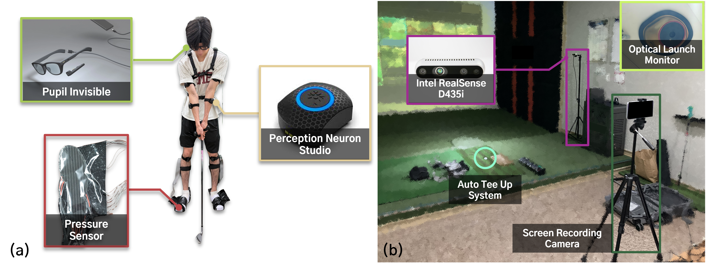
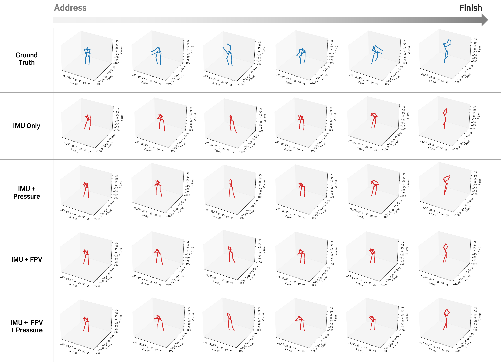

# MultiSenseGolf: A Multimodal Wearable Sensor Dataset for Sensor Fusion-Based Human Pose Estimation in Golf Swing Coaching Systems




MultiSenseGolf is a multimodal wearable sensor-based golf swing motion dataset tailored to train sensor fusion-based 3D human pose estimation (HPE). It consists of 1,557 swing samples from 24 participants ranging from beginners to professionals. The dataset integrates synchronized streams from a 17-channel whole-body IMU system, custom insole pressure sensors, a glass-type sensor recording first-person view (FPV) video with gaze tracking, and external RGB-D video. Post-hoc temporal alignment across heterogeneous sensors is established using an event-based time synchronization procedure. Additionally, shot outcome metrics recorded by a vision-based launch monitor, such as carry distance and ball speed, are provided as metadata. Dataset access is available at https://doi.org/10.7910/DVN/LCCLLW.

---

#### Installation Instructions
```powershell
# 1. Create a conda virtual environment.
conda create -n msg python=3.11 -y
conda activate msg

# 2. Install required python libraries 
python -m pip install -r requirements.txt
```

#### Data Download & Directory Layout

Download the dataset from the official link: https://doi.org/10.7910/DVN/LCCLLW  
After downloading, place the data under the project root as `Data/` so the tutorials can locate files by subject and swing.

If a participant is split into multiple parts (e.g., `Sub24_1`, `Sub24_2`), merge them into a single subject folder (e.g., `Sub24`) before running the tutorials.

```
MultiSenseGolf/
├─ Data/
│  ├─ Sub01/
│  │  ├─ Swing01/
│  │  │  ├─ sub01_Swing01_stream_data.hdf5
│  │  │  ├─ ...
│  │  │  └─ FPV_RGB.mp4
│  │  │
│  │  ├─ Swing02/
│  │  │  └─ ...
│  │  └─ ...
│  │ 
│  ├─ Sub02/
│  │  └─ ...
│  │
│  ├─ ...
│  └─ Sub24/
│  
├─ tutorials/
└─ benchmark/
```
<br>

#### Data Usage Tutorial

##### Load HDF5 Data
```powershell
# Load target swing data stored in a corresponding HDF5 file
python tutorials/load_hdf5.py --subject Sub24 --swing Swing01

# save loaded data as JSON formatted file 
python tutorials/load_hdf5.py --subject Sub24 --swing Swing01 --save-dir outputs
```

##### Visualization Examples

```powershell
# Visualize PNS 3D joint skeleton from the HDF5 file.
python tutorials/visualize_mocap.py --subject Sub24 --swing Swing01

# Visualize insole pressure heatmaps from the HDF5 file.
python tutorials/visualize_pressure.py --subject Sub24 --swing Swing01

# Visualize gaze points overlaid on FPV video.
python tutorials/visualize_fpv_and_gaze.py --subject Sub24 --swing Swing01
```

<br>

#### Benchmark Test 
To support reproducibility, we release the full benchmark code and configuration used in the Technical Validation experiments of the paper. We benchmarked supervised 3D Human Pose Estimation from multimodal golf swing data using four input conditions: `IMU Only`, `IMU + Pressure`, `IMU + FPV`, and `IMU + Pressure + FPV`. Inputs are provided as time aligned sequences consisting of (1) IMU features derived from body worn sensors, (2) bilateral insole pressure maps represented as 24×10 arrays per foot, and (3) FPV video embeddings extracted per frame. We report MPJPE, MPJVE, and Jitter across three baseline backbones (TCN, BiLSTM, Transformer), and the best overall MPJPE is achieved by the TCN with `IMU + Pressure + FPV`. Detailed experiment design and results can be found in the paper (Not published yet). 


##### How to Run

```powershell
# 1. (Optional) Create a subject split file if you want a new split.
python benchmark/scripts/make_splits.py --root Data --out benchmark/configs/split.json

# 2. (Optional, only if using FPV modality) Precompute FPV features.
python benchmark/scripts/cache_features_fpv.py --root Data

# 3. (Recommended) Sanity-check dataset availability and shapes.
python benchmark/scripts/sanity_check_data.py --root Data

# 4. Train a single experiment.
python benchmark/src/train/train.py --config benchmark/configs/exp_imu.yaml

# 5. (Optional) Run all configs and summarize results.
python benchmark/scripts/run_all_exps.py
```

##### Qualitative Results


