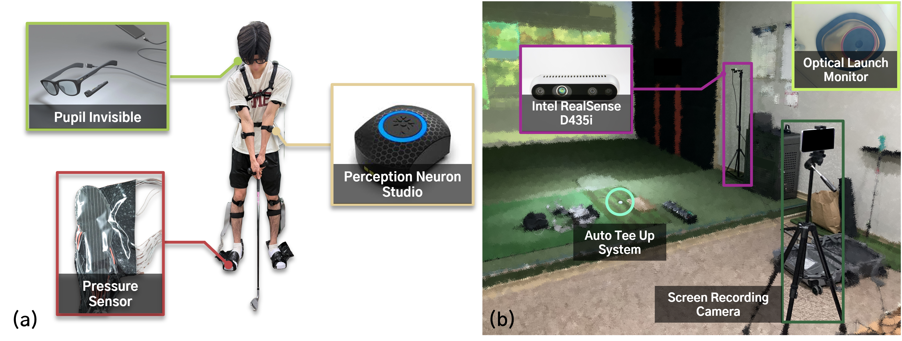

# MultiSenseGolf: A Multimodal Sensor-Based Dataset for Golf Swing Motion and Shot Performance Analysis



MultiSenseGolf is a multimodal sensor-based dataset for golf swing motion and shot performance analyses. It consists of 1,557 swing samples from 24 participants across Beginner, Intermediate, and Professional groups. The dataset combines full-body joint kinematic estimates, bilateral foot pressure recordings, first-person view (FPV) video, gaze and head-motion data, external RGB-D video, and shot outcome measurements. Recordings are provided as swing-level records, with visually identified impact events used for post-hoc timestamp offset correction across device clocks. Dataset access is available at [Harvard Dataverse](https://doi.org/10.7910/DVN/LCCLLW).

---

## Initial Setup

### Installation

```powershell
# 1. Create a conda virtual environment.
conda create -n msg python=3.11 -y
conda activate msg

# 2. Install required Python libraries.
python -m pip install -r requirements.txt
```

### Data Download & Directory Layout

Download the dataset from the [official link](https://doi.org/10.7910/DVN/LCCLLW). After downloading, place the data under the project root as `Data/` so the tutorials can locate files by participant and swing.

If a participant is split into multiple parts (e.g., `P24_1`, `P24_2`), merge them into a single participant folder (e.g., `P24`) before running the tutorials.

```text
MultiSenseGolf/
├─ Data/
│  ├─ P01/
│  │  ├─ Swing01/
│  │  │  ├─ P01_Swing01_stream_data.hdf5
│  │  │  ├─ ...
│  │  │  └─ FPV_RGB.mp4
│  │  ├─ Swing02/
│  │  │  └─ ...
│  │  └─ ...
│  ├─ P02/
│  │  └─ ...
│  ├─ ...
│  ├─ P24/
│  └─ Documentation/
│     ├─ Participant Metadata.csv
│     └─ Annotation Data.csv
├─ tutorials/
└─ benchmark/
```

<br>

## Data Usage Tutorial

### Load HDF5 Data

```powershell
# Load target swing data stored in the corresponding HDF5 file.
python tutorials/load_hdf5.py --participant P24 --swing Swing01

# Save loaded data as a JSON file.
python tutorials/load_hdf5.py --participant P24 --swing Swing01 --save-dir outputs
```

### Visualization Examples

```powershell
# Visualize the root-relative PNS 3D joint skeleton.
python tutorials/visualize_mocap.py --participant P24 --swing Swing01

# Visualize insole pressure heatmaps.
python tutorials/visualize_pressure.py --participant P24 --swing Swing01

# Visualize gaze points overlaid on FPV video.
python tutorials/visualize_fpv_and_gaze.py --participant P24 --swing Swing01
```

### Statistical Analysis Tutorials

```powershell
# Analyze carry distance across five participant characteristics.
python tutorials/carry_distance_analysis.py
```

<br>

## Benchmark Test

The benchmark predicts shot outcomes using five single-modality inputs: lead-hand kinematics, head IMU, foot pressure, FPV video, and front-view 2D motion features. Ball Speed is evaluated as a regression task, while Spin Axis and Launch Direction are evaluated as classification tasks. Ridge/Logistic Regression and XGBoost are compared using four participant-independent outer folds and three participant-grouped inner folds, with a no-sensor baseline for comparison. Regression results include R2, RMSE, and MAE; classification results include macro AUC, balanced accuracy, and macro F1.

### How to Run

```powershell
# Extract features, train models, and evaluate the benchmark.
python benchmark/run_benchmark.py --data-root Data --device cuda
```

Use `--device cpu` for CPU execution. Results are saved under `benchmark/outputs/`. The random seed and hyperparameter search grids are in `benchmark/config.yaml`, and participant fold assignments are in `benchmark/folds.csv`.
